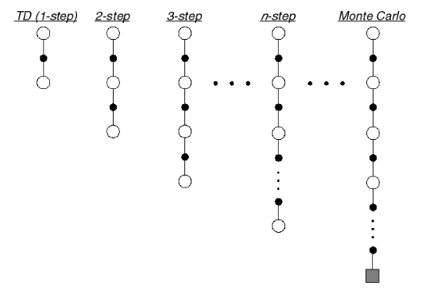
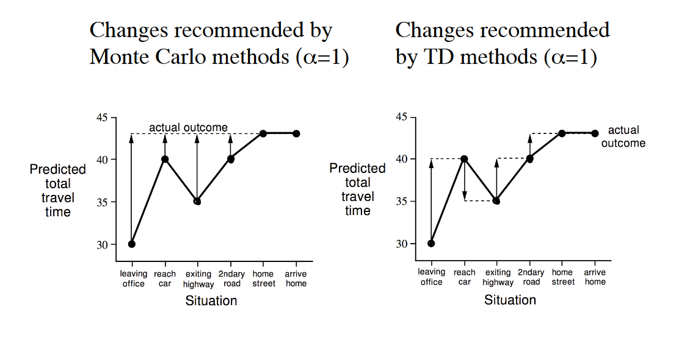

# Model Free Reinforcement Learning

- [Model Free Reinforcement Learning](#model-free-reinforcement-learning)
  - [Monte-Carlo Reinforcement Learning](#monte-carlo-reinforcement-learning)
    - [Monte-Carlo Policy Evaluation](#monte-carlo-policy-evaluation)
      - [First-Visit Monte-Carlo Policy Evaluation](#first-visit-monte-carlo-policy-evaluation)
      - [Every-Visit Monte-Carlo Policy Evaluation](#every-visit-monte-carlo-policy-evaluation)
  - [Temporal-Difference Learning](#temporal-difference-learning)
    - [N-Step TD](#n-step-td)
    - [$\lambda$ return](#lambda-return)
    - [Forward-View TD $\lambda$](#forward-view-td-lambda)
    - [Backward-View TD $\lambda$](#backward-view-td-lambda)
      - [Eligibility Trace](#eligibility-trace)
    - [Theorem](#theorem)
  - [Comparison of Update between MC & TD](#comparison-of-update-between-mc--td)
  - [Advantages and Disadvantages of MC vs. TD](#advantages-and-disadvantages-of-mc-vs-td)
    - [Bias & Variance](#bias--variance)
      - [TD Bias](#td-bias)
  - [Online Update vs. Offline Update](#online-update-vs-offline-update)
    - [Offline Update](#offline-update)
    - [Online Update](#online-update)
      - [Exact Online TD-$\lambda$](#exact-online-td-lambda)

| Offline Update | $\lambda=0$ | $\lambda\in(0,1)$         | $\lambda=1$ |
| -------------- | ----------- | ------------------------- | ----------- |
| Backward View  | TD(0) [=]   | TD ($\lambda$) [=]        | TD(1)       |
| Forward View   | TD(0) [=]   | Forward TD($\lambda$) [=] | MC          |

| Online Update | $\lambda=0$ | $\lambda\in(0,1)$                                   | $\lambda=1$        |
| ------------- | ----------- | --------------------------------------------------- | ------------------ |
| Backward View | TD(0)       | TD($\lambda$)   [$\neq$ Forward TD($\lambda$)]      | TD(1) [$\neq$ MC]  |
| Forward View  | TD(0)       | Forward TD($\lambda$) [=Exact Online TD($\lambda$)] | MC                 |
| Exact Online  | TD(0)       | Exact Online TD($\lambda$)                          | Exact Online TD(1) |

$=$ here indicates equivalence in total update at end of episode

## Monte-Carlo Reinforcement Learning

- Learn directly from episodes of experience
- value = mean return
- $G_t=R_{t+1}+\gamma R_{t+2}+...$
- $v_t=\mathbb{E}_\pi[G_t|S]$
  
### Monte-Carlo Policy Evaluation

- Monte-Carlo policy evaluation uses empirical mean return instead of expected return

#### First-Visit Monte-Carlo Policy Evaluation

#### Every-Visit Monte-Carlo Policy Evaluation

**Incremental Update**
- $N(S_t) \mathrel{{+}{=}} 1$
- $V(S_t) \mathrel{{+}{=}} \frac{1}{N(S_t)}(G_t-V(S_t))$
- $V(S_t) \mathrel{{+}{=}} \alpha(G_t-V(S_t))$

## Temporal-Difference Learning

- Learn directly from episodes of experience
- TD updates a guess towards a guess

**Incremental Update**
- $V(S_t) \mathrel{{+}{=}} \alpha(R_{t+1}+V(S_{t+1})-V(S_t))$

### N-Step TD

- $V(S_t) \mathrel{{+}{=}} \alpha(R_{t+1}+R_{t+2}+...+R_{t+n}+V(S_{t+n+1})-V(S_t))$

### $\lambda$ return

- $G_t^\lambda=(1-\lambda)\sum_{n=1}^\infty {\lambda^{n-1}}G_t^(n)$

### Forward-View TD $\lambda$ 

- $V(S_t) \mathrel{{+}{=}} \alpha(G_t^\lambda-V(S_t))$ 

### Backward-View TD $\lambda$ 

- Forward view provides theory
- Backward view provides mechanism
- Update online, every step, from incomplete sequences

#### Eligibility Trace

Keep an eligibility trace for every state $s$

- **Frequency heuristic**: assign credit to most frequent states
- **Recency heuristic**: assign credit to most recent states
- Eligibility traces combine both heuristics

$$ 
  \begin{aligned}
    E_0(s)&=0\\
    E_t(s)&=\gamma\lambda E_{t-1}(s)+\mathbb{1}(S_t=s)\\
    \delta_t(\text{TD Error})&=R_{t+1}+\gamma V(S_{t+1})-V(S_t)\\
    V(s)    & \mathrel{{+}{=}}\alpha\delta_tE_t(s)
  \end{aligned}
$$

### Theorem

- The sum of offline updates is identical for forward-view and backward-view TD(λ)

## Comparison of Update between MC & TD

## Advantages and Disadvantages of MC vs. TD

- TD can learn before knowing the final outcome
  - TD can learn online after **every step**
  - MC must wait until **end of episode** before return is known
- TD can learn without the final outcome
  - TD can learn from **incomplete sequences**
  - MC can only learn from **complete sequences**
  - TD works in continuing (non-terminating) environments
  - MC only works for episodic (terminating) environments
- MC Converge better
- TD Converge 

### Bias & Variance

- MC is unbiased estimation (high variance)
- TD is biased estimation (low variance)
  
#### TD Bias
  
$$
\begin{aligned}
    V_{t+1}(s)
        &=\alpha(R_{t+1}+V(S_{t+1})-V(S_t))\\
        &=(1-\alpha)V_t(S)+\alpha(R+V(s'))\\
        &=(1-\alpha)^tV_1(s)+\sum_{i=1}^t \alpha(1-\alpha )^{t-1}(R+V(s'))
\end{aligned}
$$

- The start value will continuously affect the biased estimation, but will decrease over time [$(1-\alpha)^t$] and $V_t$ will gradually become the true value function

## Online Update vs. Offline Update

### Offline Update

- Updates are accumulated within episode
- but applied in batch at the end of episode

### Online Update

- Forward & Backward TD($\lambda$) are slightly different

#### Exact Online TD-$\lambda$ 

- truncated $\lambda$-return algorithm (truncated till the current time step instead of the end of the episode)
- Modify previous $\lambda$-return of the previous steps 
- [True Online TD(λ)](http://proceedings.mlr.press/v32/seijen14.pdf)